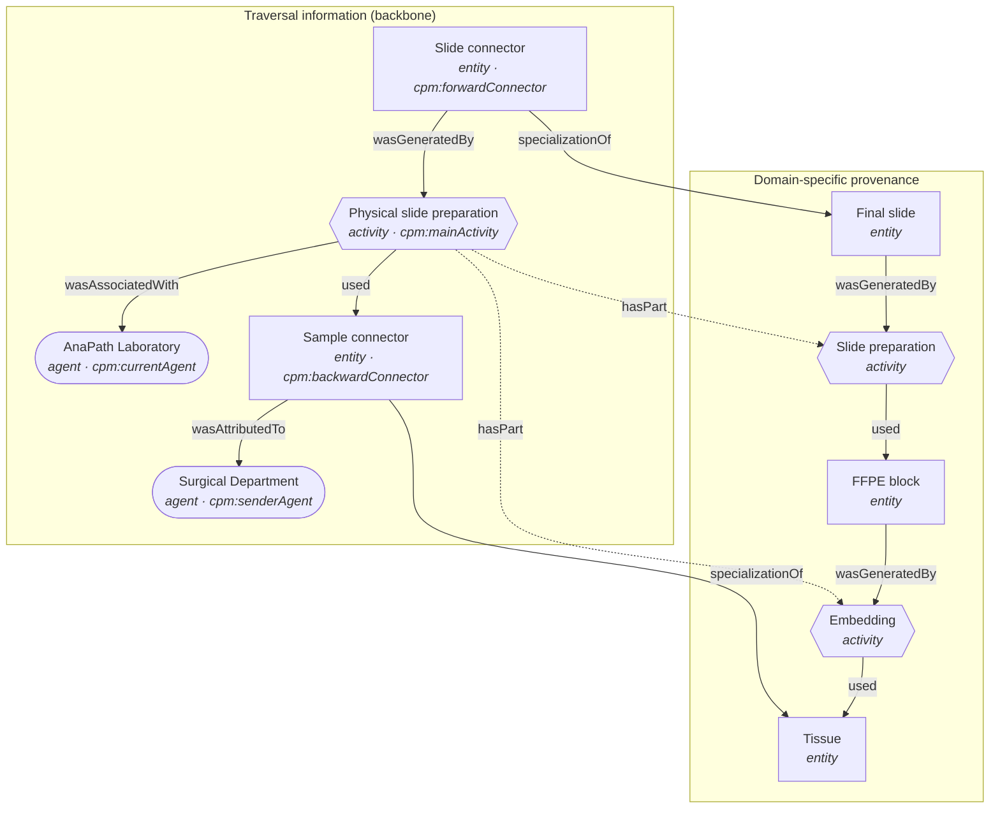

# Provenance graph

The graph produced by `DigitalPathologyMapper` from
[`samples/preanalytics-case-0.json`](../src/main/resources/samples/preanalytics-case-0.json),
i.e. the `aplab:preanalyticsIn_bundle` bundle. Two layers: the
**traversal-information backbone** (generated by the mapper from the typed nodes,
so it is always well-formed) and the **domain-specific provenance** (translated
one-to-one from the input's `relations[]`). They are linked by `specializationOf`.

## Legend

- **Rounded** = agent, **rectangle** = entity, **hexagon** = activity.
- Solid arrows are PROV relations (label = relation type). Dotted arrows are the
  main activity's `dct:hasPart` over the domain steps.
- An arrow `A -- rel --> B` reads as the PROV statement *A rel B* — e.g.
  `Sample connector -- wasAttributedTo --> Surgical Department`, and
  `Sample connector -- specializationOf --> Tissue` (the connector is the
  **specific** entity, the domain entity is the **general** one).

## The backbone, precisely

1. one `cpm:backwardConnector` `wasAttributedTo` one `cpm:senderAgent`;
2. the `cpm:mainActivity` `used` that backward connector;
3. the main activity `wasAssociatedWith` one `cpm:currentAgent`;
4. one `cpm:forwardConnector` `wasGeneratedBy` the main activity.

The connectors bridge to the domain via `specializationOf`, and the domain is a
plain `entity ←used— activity —wasGeneratedBy→ entity` chain. To regenerate this
file's graph, run the mapper (see [AGENTS.md](../AGENTS.md)) and read the emitted
`target/out/aplab_preanalyticsIn_bundle.json`.
